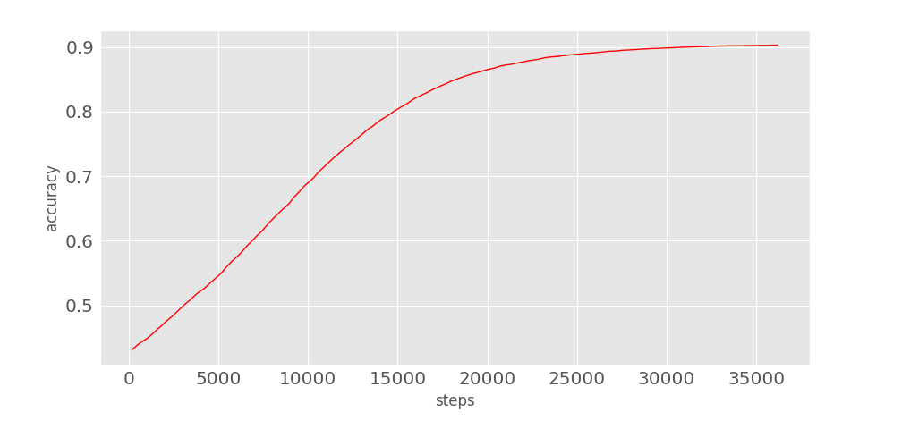
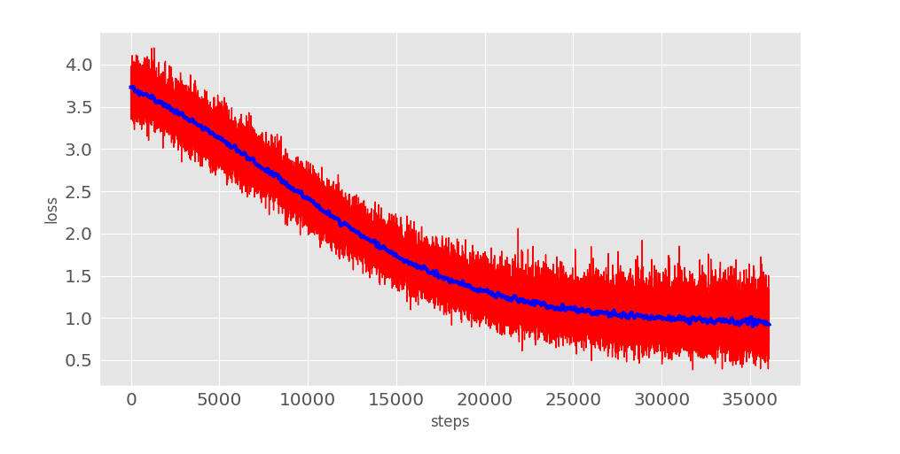

# 保险行业语料库
[详细文档](https://github.com/Samurais/insuranceqa-corpus-zh/wiki)

# 大家怎么说

> 看了下您的项目，我觉得这份数据可以用于保险领域的中文问答研究，对于较短的问题翻译很准确，长度较长的答案翻译就有些不连贯的问题，大体上关键词信息和一些上下文信息都有，我觉得是份很好的中文语料。 - [fssqawj](https://github.com/fssqawj), East China Normal University

> Excellent work! - [rgtjf](https://github.com/rgtjf), East China Normal University

# 基线

Baseline model for [insuranceqa-corpus-zh](https://github.com/Samurais/insuranceqa-corpus-zh/wiki) 

mini-batch size = 100, hidden_layers = [100, 50], lr = 0.0001.





> Epoch 25, total step 36400, accuracy 0.9031, cost 1.056221.

## Deps
Python3+

```
pip install -r Requirements.txt
```

## Run
A very simple network as baseline model.
```
python3 deep_qa_1/network.py
python3 visual/accuracy.py
python3 visual/loss.py
```

下载[文档](./deep_qa_1/baseline_article.pdf)了解更多关于DeepQA-1的实现和Baseline。

## 声明

声明1 : [insuranceqa-corpus-zh](https://github.com/Samurais/insuranceqa-corpus-zh)

本数据集使用翻译 [insuranceQA](https://github.com/shuzi/insuranceQA)而生成，代码发布证书 GPL 3.0。数据仅限于研究用途，如果在发布的任何媒体、期刊、杂志或博客等内容时，必须注明引用和地址。

```
InsuranceQA Corpus, Hai Liang Wang, https://github.com/Samurais/insuranceqa-corpus-zh, 07 27, 2017
```

任何基于[insuranceqa-corpus](https://github.com/Samurais/insuranceqa-corpus-zh)衍生的数据也需要开放并需要声明和“声明1”和“声明2”一致的内容。

声明2 : [insuranceQA](https://github.com/shuzi/insuranceQA)

此数据集仅作为研究目的提供。如果您使用这些数据发表任何内容，请引用我们的论文：[Applying Deep Learning to Answer Selection: A Study and An Open Task](https://arxiv.org/abs/1508.01585)。Minwei Feng, Bing Xiang, Michael R. Glass, Lidan Wang, Bowen Zhou @ 2015